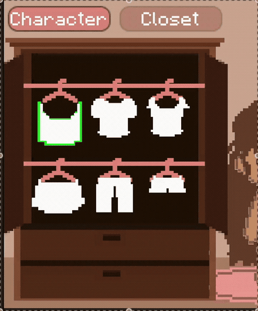

# Interactive Wardrobe Customization

Interactive Wardrobe Customization is a playful 2D fashion game built around direct, tactile interaction. Players experiment with clothing combinations, customize colors and patterns, and design outfits for different body types, skin tones, and hairstyles in a gamified pixel-art environment.


## Interaction demo

The interaction below shows a garment being removed from its hanger and dragged onto the character, where it snaps into place.



## Project context

This project was developed for the **Advanced Programming of Interactive Systems** course from **September to October 2025** by **Fatemeh Shirvani** and **Kimia Senichault**.

The design goal was to make customization feel like manipulating a physical wardrobe instead of completing a sequence of forms. Interface elements therefore respond spatially: doors and drawers slide, hangers move along their rail, and garments can be pulled from the closet and snapped onto the character.

## Interaction design

- **Direct manipulation:** drag closet doors, drawers, hangers, garments, and customization elements rather than navigating menus alone.
- **Constrained movement:** doors move horizontally, drawers move vertically, and hangers remain aligned with their rail so each object behaves as expected.
- **Drag-and-snap dressing:** take clothing from its hanger and drag it onto the character; snapping makes successful placement clear and forgiving.
- **Immediate feedback:** selection outlines, responsive panels, and visible state changes communicate what can be edited and what the player has chosen.
- **Character customization:** select a body type and hairstyle, then click either the body or hair directly on the character to change its color from the right-hand panel.
- **Clothing customization:** select a garment, browse colors and patterns by sliding through the available choices, and combine them to create an outfit.
- **Custom colors:** select the **+** control and use the color ramp to add a new color.
- **Advised colors:** whenever a color is selected, the interface displays matching colors under **Advised colors**. These suggestions support color exploration without restricting the player's choices.
- **Custom patterns:** select the pattern **+** control and choose an image file from the computer. The imported image is pixelated so it remains visually consistent with the game's art style.
- **Playful details:** the character's eyes follow the pointer, reinforcing that the world responds to the player.
- **Scene navigation:** the buttons at the top of the interface switch between the character and closet views.
- **Discoverability:** the **Help** button opens a pop-up that explains the available interactions.
- **Persistence and sharing:** the camera button saves the character as a PNG screenshot, **Save** stores the character as JSON, and **Import** restores a character from a JSON file.

## Interface views

### Clothing customization

Select a garment to open its editing controls. Browse the color and pattern rows, add a color with the color ramp, review the advised matching colors, or import a custom image pattern that is converted to the pixel-art style.


### Character customization

Choose a body type and hairstyle. Selecting the body or hair directly on the character opens its palette-based color controls in the panel on the right.


## Controls

| Action | Interaction |
| --- | --- |
| Open or close a closet door | Drag horizontally |
| Open or close a drawer | Drag vertically |
| Move a hanger on the rail | Drag left or right |
| Remove a hanger | Drag it downward from the rail |
| Dress the character | Drag a garment onto the character |
| Edit an item | Select it to reveal the relevant controls |
| Browse colors and patterns | Slide through the rows of available choices |
| Add a custom color | Select **+** and choose a color from the color ramp |
| View matching colors | Select a color and review the **Advised colors** panel |
| Add a custom pattern | Select **+** and choose an image file to pixelate and apply |
| Switch views | Use the character and closet buttons at the top |
| View instructions | Use the help button to open the explanation pop-up |
| Save or restore a character | Use the save and import controls for JSON data |
| Export an image | Use the camera control to save a PNG |

## Technical implementation

The project is implemented in **Unity 6** and **C#**. The character, clothing, environment, interface, and other pixel-art sprites were created by the project team. Interaction responsibilities are separated so that input and movement logic remain close to the objects they control:

- `ClosetInteractions` contains the door, drawer, hanger, clothing, and snapping behavior.
- `CharacterCustomInteractions` handles color and pattern selection, clothing choices, body types, and hairstyles.
- `ClosetInteractions` implements doors, drawers, hanger movement, garment dragging, and snapping.
- `Managers` coordinate character customization, clothing state, and supporting UI logic.
- `View` manages the right-hand panels, item-selection outlines, help interface, and pointer-responsive eye movement.
- `Utilities` provides advised-color generation, PNG capture, and JSON save/import functionality.
- `SwitchScene` connects the top navigation buttons to the character and closet views.

The UI uses TextMesh Pro, and the project includes file-browser and color-picker components for importing patterns and choosing custom colors.

## Project structure

```text
clothing-interaction-project/
├── Assets/
│   ├── Scenes/
│   ├── Scripts/
│   │   ├── Controllers/
│   │   ├── Managers/
│   │   ├── Utilities/
│   │   └── View/
│   └── Sprites/
├── Packages/
└── ProjectSettings/
```

## Run locally

1. Install Unity Hub and Unity Editor **6000.0.23f1**.
2. Add the `clothing-interaction-project` directory as an existing Unity project.
3. Open `Assets/Scenes/MainScene.unity`.
4. Enter Play mode in the Unity Editor.

Because the complete Unity source and assets are included, the interactions can be inspected and extended even if the original build is unavailable.

## Authors

- Fatemeh Shirvani
- Kimia Senichault
