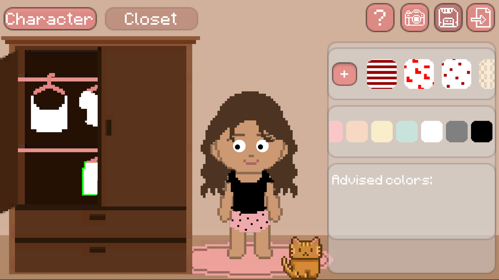
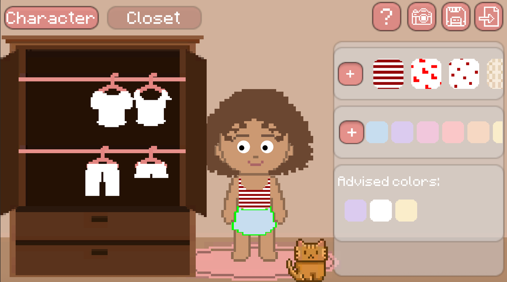
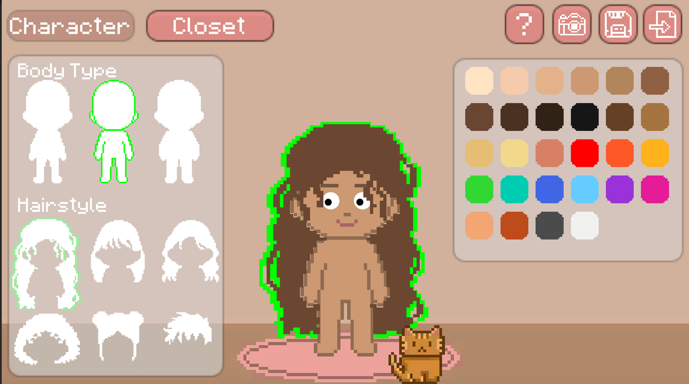

# Interactive Wardrobe Customization

Interactive Wardrobe Customization is a playful 2D wardrobe experience built around direct, tactile interaction. Players create a character, explore a closet, recolor garments, apply patterns, and assemble outfits through a pixel-art interface.



## Project context

This project was developed for the **Advanced Programming of Interactive Systems** course during the 2025–2026 academic year by **Fatemeh Shirvani** and **Kimia Senichault**.

The design goal was to make customization feel like manipulating a physical wardrobe instead of completing a sequence of forms. Interface elements therefore respond spatially: doors and drawers slide, hangers move along their rail, and garments can be pulled from the closet and snapped onto the character.

## Interaction design

- **Direct manipulation:** drag closet doors, drawers, hangers, garments, and customization elements rather than navigating menus alone.
- **Constrained movement:** doors move horizontally, drawers move vertically, and hangers remain aligned with their rail so each object behaves as expected.
- **Drag-and-snap dressing:** take clothing from its hanger and drag it onto the character; snapping makes successful placement clear and forgiving.
- **Immediate feedback:** selection outlines, responsive panels, and visible state changes communicate what can be edited and what the player has chosen.
- **Character customization:** switch body type and hairstyle, then recolor the body and hair with a palette.
- **Clothing customization:** recolor garments, choose built-in patterns, or import a JPG/PNG pattern from the computer.
- **Color guidance:** suggested colors help players explore compatible combinations without restricting their choices.
- **Playful details:** the character's eyes follow the pointer, reinforcing that the world responds to the player.
- **Discoverability:** an in-game help view explains the main interactions.
- **Persistence and sharing:** save a character configuration as JSON, import it later, or export the composition as a PNG image.

## Interface views

### Clothing customization

Select a garment to open its editing controls, then combine colors and patterns or import a custom texture.



### Character customization

Choose the body type and hairstyle and adjust their colors through the palette-based controls.



## Controls

| Action | Interaction |
| --- | --- |
| Open or close a closet door | Drag horizontally |
| Open or close a drawer | Drag vertically |
| Move a hanger on the rail | Drag left or right |
| Remove a hanger | Drag it downward from the rail |
| Dress the character | Drag a garment onto the character |
| Edit an item | Select it to reveal the relevant controls |
| Add a custom color or pattern | Select the **+** control and choose a color or image |
| Save or restore a character | Use the save and import controls for JSON data |
| Export an image | Use the camera control to save a PNG |

## Technical implementation

The project is implemented in **Unity 6** and **C#**. Interaction responsibilities are separated so that input and movement logic remain close to the objects they control:

- `ClosetInteractions` contains the door, drawer, hanger, clothing, and snapping behavior.
- `CharacterCustomization` handles selectable body and hairstyle options.
- `Managers` coordinate customization state and UI behavior.
- `View` contains selection, panels, and pointer-responsive visual behavior.
- `Utilities` provides color advice, screenshots, and JSON save/import functionality.

The UI uses TextMesh Pro, and the project includes file-browser and color-picker components for importing patterns and choosing custom colors.

## Project structure

```text
clothing-interaction-project/
├── Assets/
│   ├── Scenes/
│   ├── Scripts/
│   │   ├── Controllers/
│   │   ├── Managers/
│   │   ├── Utilities/
│   │   └── View/
│   └── Sprites/
├── Packages/
└── ProjectSettings/
```

## Run locally

1. Install Unity Hub and Unity Editor **6000.0.23f1**.
2. Add the `clothing-interaction-project` directory as an existing Unity project.
3. Open `Assets/Scenes/MainScene.unity`.
4. Enter Play mode in the Unity Editor.

Because the complete Unity source and assets are included, the interactions can be inspected and extended even if the original build is unavailable.

## Authors

- Fatemeh Shirvani
- Kimia Senichault
